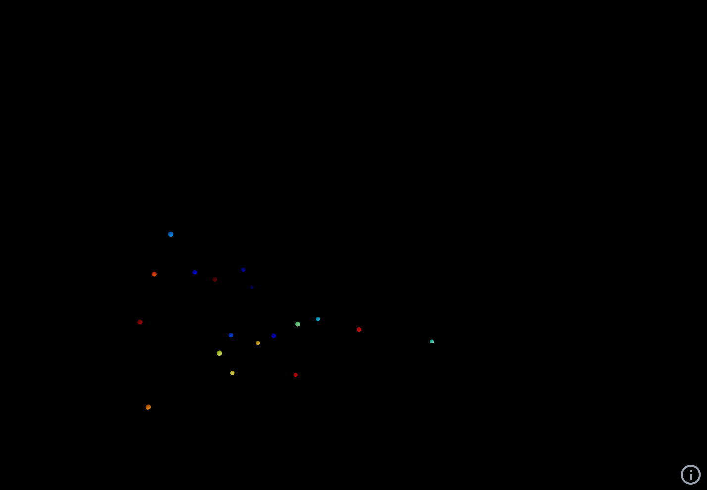

## 3D Sound Source Visualizer for Spatial Audio



[Live Demo Here](https://source-viewer.vercel.app/)

Position Viewer in Browser for Object-Based Audio Spatialization via OSC, built with Next.js, Three.js (react-three-fiber) and osc-js.

The interface allows the viewing of sound sources and speaker position in a 3D Environment / First Person View in the browser, and allows viewing / controlling listener position / orientation across a network from a server through WebSockets.

### Connection:
1) Open a WebSocket server for OSC on the host computer. (Please refer to Examples)
2) Open the Interface and enter the IP address and port number to connect. localhost in IP for local use on same computer.
3) Refer to the Info Button for Controls in the Interface

### Supported OSC Messages:
#### From Host to Viewer
Position
```
/[source/speaker]/[index]/xyz [x y z]
```
Color
```
/[source/speaker]/[index]/color [r g b a] <Normalized Value 0-1>
```
Number of Source/Speakers displayed
```
/[source/speaker]/number <number>
```
#### From Viewer to Host
```
/listener/position [x y z]
```
```
/listener/orientation [z y x w] <Quaternion>
```
Note: Coordinate and Quaternion formats follow the format in SPAT5.

### Example
https://github.com/mageeagle/source-viewer-example

### Tips

#### Performance Issues
The default page of the viewer uses InstancedMesh, which allows a large amount of source/speakers to be viewed at once without noticeable performance issues, 
at the cost of individual source opacity options and fading away if they are not moving.

Another page can be accessed to enable individual opacity changes and source fading, but large amount of source/speakers would cause performance issues.


#### Broadcasting to multiple devices
Source/Speaker Numbers and Colors are not saved across sessions and different devices. To keep consistancy, the data could be saved on the server and sent to new devices connected to the WebSocket server. This is out of scope of this Front-End Interface. Please refer to the examples.

### Future Plans
Add support for VR
